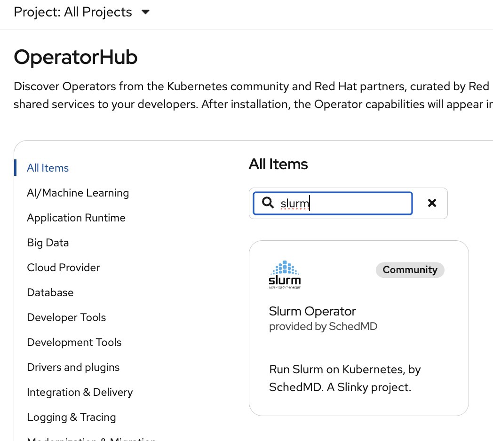

# slinky-on-openshift
Pattern for running the [Slurm operator](https://github.com/SlinkyProject/slurm-operator) on OpenShift

Images are built out of the [redhat-hpc/slinkyproject-containers](https://github.com/redhat-hpc/slinkyproject-containers) project with CentOS Stream and OpenHPC and are available on [quay.io](https://quay.io/organization/slinky-on-openshift)

## Quickstart

### Prerequisites

* `oc` must be installed
* `helm` must be installed

### Install Slinky, the Slurm Operator

Install the operator using the OperatorHub:



### Install Slurm

Create the namespace with privileged SecurityContextConstraint. This makes it easier to deploy Slurm in
containers today but in the future we plan to provide a more restrictive SCC that fits what Slurm requires.

```
oc adm new-project slurm
oc adm policy add-scc-to-user privileged -n slurm -z default
```

This `helm` command is overriding the default images in favor of the images built on CentOS Stream 9 and OpenHPC
but they are not required for running Slinky on OpenShift.

```
helm install slurm oci://ghcr.io/slinkyproject/charts/slurm --namespace=slurm \
  --version 1.0.1 \
  --set configFiles.gres\\.conf="AutoDetect=nvidia" \
  --set loginsets.slinky.enabled=true \
  --set loginsets.slinky.login.securityContext.privileged=true \
  --set controller.slurmctld.image.repository=quay.io/slinky-on-openshift/slurmctld \
  --set controller.slurmctld.image.tag=25.05.4-centos9-ohpc \
  --set controller.reconfigure.image.repository=quay.io/slinky-on-openshift/slurmctld \
  --set controller.reconfigure.image.tag=25.05.4-centos9-ohpc \
  --set restapi.slurmrestd.image.repository=quay.io/slinky-on-openshift/slurmrestd \
  --set restapi.slurmrestd.image.tag=25.05.4-centos9-ohpc \
  --set accounting.slurmdbd.image.repository=quay.io/slinky-on-openshift/slurmdbd \
  --set accounting.slurmdbd.image.tag=25.05.4-centos9-ohpc \
  --set loginsets.slinky.login.image.repository=quay.io/slinky-on-openshift/login \
  --set loginsets.slinky.login.image.tag=25.05.4-centos9-ohpc \
  --set nodesets.slinky.slurmd.image.repository=quay.io/slinky-on-openshift/slurmd \
  --set nodesets.slinky.slurmd.image.tag=25.05.4-centos9-ohpc \
  --set nodesets.slinky.replicas=3 \
  --set-literal loginsets.slinky.rootSshAuthorizedKeys="$(cat $HOME/.ssh/id_rsa.pub)"
```

The full list of options for the helm chart can be [found in the upstream repository](https://github.com/SlinkyProject/slurm-operator/blob/release-1.0/helm/slurm/values.yaml)

#### Request slurmd Resources

By default, the operator will create slurm worker pods that do not request any CPU/Memory which means they have no
reserved resources. Resources can be reserved by adding to the helm chart options:

```
  --set nodesets.slinky.slurmd.resources.limits.cpu=15 \
  --set nodesets.slinky.slurmd.resources.requests.cpu=15 \
  --set nodesets.slinky.slurmd.resources.limits.memory=60Gi \
  --set nodesets.slinky.slurmd.resources.requests.memory=56Gi \
```

#### Use shared storage

If you have shared storage deployed already (such as CephFS or NFS), you can add these options to the helm install:

```
  --set-json 'loginsets.slinky.login.volumeMounts=[{"name":"shared-home","mountPath":"/home"}]' \
  --set-json 'loginsets.slinky.podSpec.volumes=[{"name":"shared-home","persistentVolumeClaim":{"claimName":"shared-home"}}]' \
  --set-json 'nodesets.slinky.slurmd.volumeMounts=[{"name":"shared-home","mountPath":"/home"}]' \
  --set-json 'nodesets.slinky.podSpec.volumes=[{"name":"shared-home","persistentVolumeClaim":{"claimName":"shared-home"}}]' \
```

Shared storage can be created using a PersistentVolumeClaim

```
cat << EOF | oc create -f -
apiVersion: v1
kind: PersistentVolumeClaim
metadata:
  name: shared-home
  namespace: slurm
spec:
  accessModes:
  - ReadWriteMany
  resources:
    requests:
      storage: 500Gi
  storageClassName: ocs-storagecluster-cephfs
  volumeMode: Filesystem
EOF

```

### Testing

#### SSH to login pod

With the deployment running, now we can SSH into the login pod. The helm chart will use a Service of `Type=LoadBalancer`
but that is dependent on the cloud provider or something like MetalLB being deployed on-premise.

We can use a simple ProxyCommand to access the SSH server with `socat` in the container image:

```
ssh -o ProxyCommand='oc exec -i -n slurm svc/%h -- socat STDIO TCP:localhost:22' root@slurm-login-slinky
```

The helm chart deploys the login pod and injects the SSH public key for the root user

#### Run a job

We can see that the nodes have checked into the cluster

```
sinfo
```
```
PARTITION AVAIL  TIMELIMIT  NODES  STATE NODELIST
debug        up   infinite      2   idle debug-[0-1]
all*         up   infinite      2   idle debug-[0-1]
```

Run a simple command on a node

```
srun -n 1 -t 1:00 hostname
```

## Uninstall Slurm and Slinky

```
helm uninstall slurm -n slurm
```

Uninstall the slurm-operator using the Operator Lifecycle Manager on the OpenShift Console.

<!--## Optional: Shared filesystem with NFS

Alternatively to the quickstart, we can deploy Slurm with a shared home area. If you have already deployed Slurm then uninstall the quickstart before installing the example with NFS

### Prerequisite: Storage

The NFS example will consume a RWO volume using the default storage class

### Deploy the NFS CSI provisionier

```
helm repo add nfs-ganesha-server-and-external-provisioner https://kubernetes-sigs.github.io/nfs-ganesha-server-and-external-provisioner/

helm install nfs nfs-ganesha-server-and-external-provisioner/nfs-server-provisioner -n nfs --create-namespace \
  -f https://raw.githubusercontent.com/redhat-na-ssa/slinky-on-openshift/refs/heads/main/helm/values-nfs-provisioner.yaml
```

### Deploy Slurm with a NFS-backed home area

```
helm upgrade -i slurm oci://quay.io/slinky-on-openshift/slinky-on-openshift --reset-values -n slurm \
  -f https://raw.githubusercontent.com/redhat-na-ssa/slinky-on-openshift/refs/heads/main/helm/values-slurm-shared-storage.yaml
```

When used with SSH, the homeareas should be created automatically on successful login.-->

<!--## Optional: Enable Autoscaling

https://github.com/SlinkyProject/slurm-operator/blob/main/docs/autoscaling.md

### Install OCP Custom Metrics Autoscaler
- add KedaController

### Enable user workload monitoring

https://docs.redhat.com/en/documentation/openshift_container_platform/4.17/html/monitoring/configuring-user-workload-monitoring#enabling-monitoring-for-user-defined-projects_preparing-to-configure-the-monitoring-stack-uwm

```yaml
apiVersion: v1
kind: ConfigMap
metadata:
  name: cluster-monitoring-config
  namespace: openshift-monitoring
data:
  config.yaml: |
    enableUserWorkload: true
```

https://docs.redhat.com/en/documentation/openshift_container_platform/4.17/html/nodes/automatically-scaling-pods-with-the-custom-metrics-autoscaler-operator#nodes-cma-autoscaling-custom-prometheus-config_nodes-cma-autoscaling-custom-trigger

https://docs.redhat.com/en/documentation/openshift_container_platform/4.17/html/monitoring/accessing-metrics#viewing-a-list-of-available-metrics_accessing-metrics-as-a-developer

### Apply scaling objects

```
oc apply -k deploy/keda
```-->
